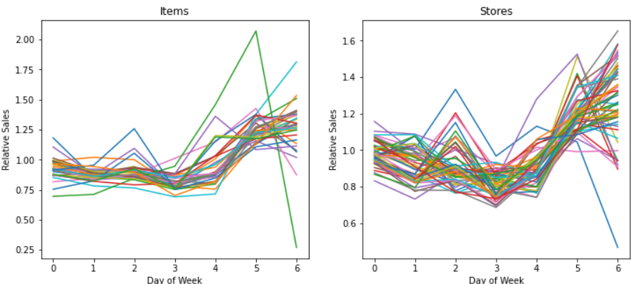

# Sales-Forecasting

## Introduction
Sales prediction plays an important role in many
fields and helps to improve the sales of a
company by making future plans by predicting
the sales of a company.

## About Model
### For Prediction We used two models - 
#### Linear Regression:
Linear regression is a very simple approach for supervised learning. Though it may seem somewhat dull compared to some of the more modern algorithms, linear regression is still a useful and widely used statistical learning method. Linear regression is used to predict a quantitative response Y from the predictor variable X.Linear Regression is made with an assumption that there’s a linear relationship between X and Y

#### XGBoost: 
XGBoost is an ensemble of the decision tree where new trees fix errors of previous trees that are already part of the model and trees are added up until there is no further improvement. 

## Steps
#### Pre-processing: 
On store sales datasets, label encoder, data parsing, and replacing or dropping of null values are done. We used Pandas for the dataset pre-processing.

#### Data-Visualization: 
Thorough understanding and a good visualisation of your dataset is more likely to improve your model’s predictions.

#### ML Model:
There are several machine learning techniques or models like linear regression, classifiers, and categorical models to fit your requirements. After data visualisation, we found our data to be more fitting on the linear regression model and for further improving the performance of model we used XGBoost Regressor model.

## Software and Tech stacks: 
##### Python >3.0v   
##### Juypter Notebook

## Libraries Used
##### Pandas
##### Numpy
##### Matplotlib
##### Sklearn
##### XGBoost

## Useful Links
###### Dataset - Store sales dataset of thousands of product families sold at Favorita stores located in Ecuador
###### Ongoing Kaggle Competition - https://www.kaggle.com/c/store-sales-time-series-forecasting

